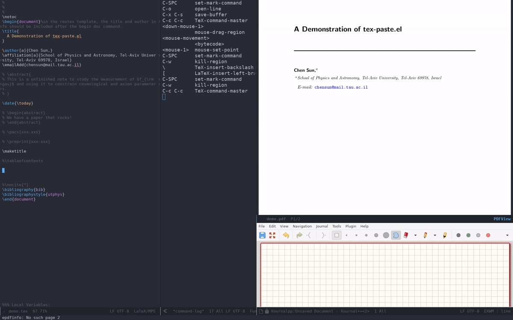

# tex-paste-figure
This is an elisp code to paste figures directly into a TeX file inside `Emacs`. A typical workflow is as follows, while having `xournalpp`  (or any other drawing app) open:

1. sketch inside `xournalpp` and copy the sketch 
3. switch back to the TeX file and invoke `tex-paste-figure`
6. type in figure name after the prompt

# Demo

# Prerequsite
`xclip`

# Debug
I tested with `xournalpp`, but I do not see any problem to substitute this as anything else that copy a figure into the `X11` clipboard. To make sure the tool is compatible, copy whatever you want to paste, and check with the following `xclip` command

    xclip -selection clipboard -t TARGETS -o
    
If you see there is "image/png" in it, it should in principle work. 

# Keybindings 
I did not set any default keybinding. In my use, I like binding it to `Hyper-i`. One can achieve this by add the following to `init.el`:

    (add-hook 'LaTeX-mode-hook
          (lambda () (local-set-key (kbd "H-i") #'tex-paste-figure)))

In this case, `H-i` inserts the plot together with the figure environment wrapping, while invoking it with a prefix such as `C-- H-i` only inserts the line of `includegraphics`. 
