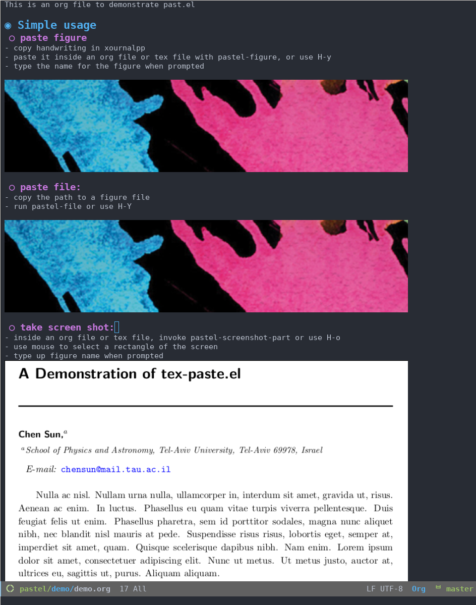

# past.el
This is an elisp code grabs a figure from {clipboard| screen selection}, save it under the folder `./drawings`, and paste the proper reference to the figure into the currently open {TeX| org} file. When paste from clipboard, the clipboard contains either the image or the path pointing to an image.  It runs with `Emacs`. A typical workflow is as follows, while having `xournalpp`  (or any other drawing app) open:

1. sketch inside `xournalpp` and copy the sketch 
1. switch back to the TeX file and invoke `pastel-figure`
1. type in figure name after the prompt

# Demo
## xournalpp -> latex

## xournalpp/file path/screenshot -> org

# Prerequsite
`xclip`, `scrot`

# How it works
## Paste of image in clipboard `pastel-figure`
After copying the sketch into the clipboard, `pastel-figure` invokes `xclip` and creates a png file inside `./drawings`. It saves the image inside the clipboard into a png file, then refers to the file using `inclugraphics` at the point of the tex file.

## Paste image with its path in clipboard `pastel-file`
It saves the image into `./drawings` folder, and adds reference to the image. 

# Installation
Include the folder that contains `past.el`. Then load it. Inside `init.el` you can add the following

    (add-to-list 'load-path "path/to/past.el/folder")
    (load "past.el")

# Keybindings 
The default keybinding is the following. You can customize inside past.el:

    (,(kbd "H-y") . ,(function pastel-figure))
    (,(kbd "H-Y") . ,(function pastel-file))    
    (,(kbd "H-o") . ,(function pastel-screenshot-part))

This means, in `LaTeX` mode, `H-y` inserts the plot together with the `figure` environment wrapping, while invoking it with a prefix such as `C-- H-i` only inserts the line of `includegraphics`. In `org-mode`, `H-y` inserts the link to the figure and toggle inline display automatically. 

# Debug
I tested with `xournalpp`, but I do not see any problem to substitute this as anything else that copy a figure into the `X11` clipboard. To make sure the tool is compatible, copy whatever you want to paste, and check with the following `xclip` command

    xclip -selection clipboard -t TARGETS -o
    
If you see there is "image/png" in it, it should in principle work. 

# Acknowledgement
I appreciate the help from `bpalmer`, `wasamasa`, and `pjb` from `#emacs` at `irc.libera.chat`.